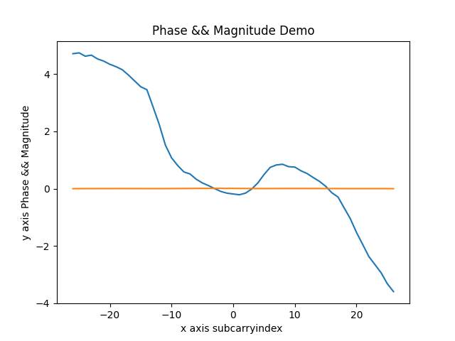

# PicoscenesToolbox

The official Python toolbox for parsing the PicoScenes **.csi** files.

## Highlights

- Support Linux and macOS
- Easy to use 
- Faster parsing than the MATLAB implementation
- High scalability
- The official toolbox for parsing .csi


## Install

1. Git clone this repository with `--recursive` option.

```bash
git clone https://github.com/Herrtian/PicoscenesToolbox.git --recursive
```

2.  install python and dependency

```bash
sudo apt update
sudo apt install python3
sudo apt install python3-pip
```

* If you are **Chinese** user, you can change pip source to accelerate download speed.

```bash
pip config set global.index-url https://mirrors.aliyun.com/pypi/simple/
```

* install dependency

 ```python
 pip3 install -r requirements.txt 
 ```

3. Build the program  

```bash
python3 setup.py build_ext --inplace
```


## Quick start

**rx_by_usrpN210.csi** is a sample binary csi file created by **Picoscenes**,now we will use it to create a chart.

```python
# main.py 

from picoscenes import  Picoscenes
import numpy as np
import matplotlib.pyplot as plt

i = 0  # stands for the first frame of csi frames

frames = Picoscenes("rx_by_usrpN210.csi")
numTones = frames.raw[i].get("CSI").get("numTones")
SubcarrierIndex = np.array(frames.raw[i].get("CSI").get("SubcarrierIndex"))
Mag = np.array(frames.raw[i].get("CSI").get("Mag"))[:numTones]

plt.title(" Magnitude Demo")
plt.xlabel("x axis subcarryindex ")
plt.ylabel("y axis Magnitude")
plt.plot(SubcarrierIndex, Mag)
plt.show()

```

  **main.py** is included in the working dir.

  This programm shows the first frame of **rx_by_usrpN210.csi** ,and draws the picture whose x-ray stands for **SubcarrierIndex** and y-ray stands for **Magnitude**.

### run the file

```bash
python3 main.py
```

If you run the programm successfully, you will get the result like this :




## Wiki && Docs

If you want to know more details about PicoscenesToolbox , you can seek **./docs** and [wiki]()


## Mistakes && Issues

If you have some questions on PicoscenesToolbox, please make me know and submit **issues** what you met.

Welcome to give this programm a **star** or **fork**.


## Reference Links

* **[PicoScenes](https://ps.zpj.io/)**: A powerful Wi-Fi sensing platform middleware for a wide range of hardware.
  * This project was released by [Zhiping Jiang](https://zpj.io/bio/).
* [**csiread**](https://github.com/citysu/csiread): A fast channel state information parser for Intel, Atheros, Nexmon and ESP32 in Python.
  - This project released by [citysu/csiread](https://github.com/citysu/csiread) inspires PicoscenesToolbox.


## License

The code in this project is licensed under MIT license. That means if you are building project by this programm,  I would greatly appreciate if you could cite this repository.

* "Tian Teng. PicoscenesToolbox: An official tool plugins for parsing **.csi** from picosecenes in Python. (2021). https://github.com/Herrtian/PicoscenesToolbox."


